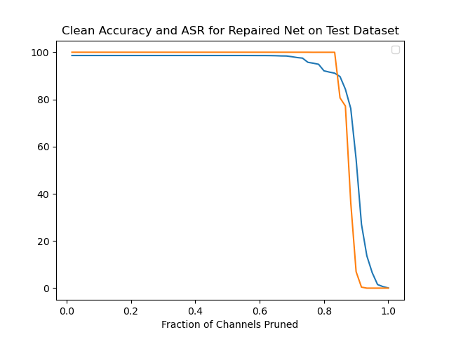

# Backdoor Detection in BadNets: A Pruning Defense

Using a backdoored facial recognition neural network, this repository applies the pruning defense outlined in this paper:
[Fine-Pruning: Defending Against Backdooring Attacks on Deep Neural Networks](https://arxiv.org/abs/1805.12185)


# Contents
- [Dependencies](#Dependencies)
- [Dataset](#Dataset)
- [Folder Structure](#Folder-Structure)
- [Architecture](#Architecture)
- [Usage](#Usage)
- [Evaluation](#Evaluating-the-Pruning-Defense-Model-On-Test-set)
- [Results and Observations](#Results-and-Observations)

# Dependencies
   1. Python 3.6.9
   2. Keras 2.3.1
   3. Numpy 1.16.3
   4. Matplotlib 2.2.2
   5. H5py 2.9.0
   6. TensorFlow-gpu 1.15.2
   First clone this repository
   ```bash
   git clone https://github.com/VaruniBuereddy/Backdoor-Detection-in-BadNets-A-Pruning-Defense.git
   ```
   ```bash
   pip install requirements.txt
   ```
   
# Dataset
   1. Download the validation and test datasets from [here](https://drive.google.com/drive/folders/1Rs68uH8Xqa4j6UxG53wzD0uyI8347dSq?usp=sharing) and store them under `data/` directory.
   2. The dataset contains images from YouTube Aligned Face Dataset. We retrieve 1283 individuals and split into validation and test datasets.
   3. bd_valid.h5 and bd_test.h5 contains validation and test images with sunglasses trigger respectively, that activates the backdoor for bd_net.h5. 
   

# Folder-Structure

```bash
├── data 
    └── cl
        └── valid.h5              // this is clean validation data used to design the defense
        └── test.h5               // this is clean test data used to evaluate the BadNet
    └── bd
        └── bd_valid.h5          // this is sunglasses poisoned validation data
        └── bd_test.h5           // this is sunglasses poisoned test data
├── models
    └── bd_net.h5
    └── bd_weights.h5
    └── Repaired_net_2_percent_threshold.h5
    └── Repaired_net_4_percent_threshold.h5
    └── Repaired_net_10_percent_threshold.h5
├── images                       // Directory contains Result Images
└── architecture.py
└── eval.py                      // this is the evaluation script
└── backdoor_detector.py         // program the implements the pruning defense on backdoored network
└── Report.pdf                  // Report
└── evaluate_repaired_net.py    // To evaluate the repaired model on Test set
└── README.md 
└── requirements.txt            // can install necessary packages using pip install requirements.txt
```
# Architecture
The state-of-the-art DeepID network serves as the basic deep neural network (DNN) for face recognition. It consists of two parallel sub-networks that feed into the final two fully connected layers after three shared convolutional layers. The [architecture.py](architecture.py) file contains the model's architecture. Below are a flow diagram and a synopsis of the model.
```
___________________________________________________________________________________
 Layer (type)                   Output Shape         Param #     Connected to                     
===================================================================================
 input (InputLayer)             [(None, 55, 47, 3)]  0           []                               
                                                                                                  
 conv_1 (Conv2D)                (None, 52, 44, 20)   980         ['input[0][0]']                  
                                                                                                  
 pool_1 (MaxPooling2D)          (None, 26, 22, 20)   0           ['conv_1[0][0]']                 
                                                                                                  
 conv_2 (Conv2D)                (None, 24, 20, 40)   7240        ['pool_1[0][0]']                 
                                                                                                  
 pool_2 (MaxPooling2D)          (None, 12, 10, 40)   0           ['conv_2[0][0]']                 
                                                                                                  
 conv_3 (Conv2D)                (None, 10, 8, 60)    21660       ['pool_2[0][0]']                 
                                                                                                  
 pool_3 (MaxPooling2D)          (None, 5, 4, 60)     0           ['conv_3[0][0]']                 
                                                                                                  
 conv_4 (Conv2D)                (None, 4, 3, 80)     19280       ['pool_3[0][0]']                 
                                                                                                  
 flatten (Flatten)              (None, 1200)         0           ['pool_3[0][0]']                 
                                                                                                  
 flatten_1 (Flatten)            (None, 960)          0           ['conv_4[0][0]']                 
                                                                                                  
 fc_1 (Dense)                   (None, 160)          192160      ['flatten[0][0]']                
                                                                                                  
 fc_2 (Dense)                   (None, 160)          153760      ['flatten_1[0][0]']              
                                                                                                  
 add (Add)                      (None, 160)          0           ['fc_1[0][0]',      
                                                                  'fc_2[0][0]']                   
                                                                                                  
 activation (Activation)        (None, 160)          0           ['add[0][0]']                    
                                                                                                  
 output (Dense)                 (None, 1283)         206563      ['activation[0][0]']             
                                                                                                  
======================================================================================
Total params: 601,643
Trainable params: 601,643
Non-trainable params: 0
______________________________________________________________________________________
```


# Usage
The program can be run by following command. The default and custom arguments are given below:

## Running the program from Command Line Interface
You can run the program with the default arguments using this command:
```bash
$ python backdoor_detector.py
```
You can also provide the program custom arguments:
```bash
$ python backdoor_detector.py --model "models/bd_net.h5" --clean_valid "'data/cl/valid.h5'" --clean_test "data/cl/test.h5" --bad_valid "data/bd/bd_valid.h5" --bad_test "data/bd/bd_test.h5" --th 2,4,10,100
```

The program will save repaired models as '.h5' files in the same directory as the backdoored models at the thresholds chosen.

# Evaluating the Pruning Defense Model On Test set
 To evaluate the pruned defense model, execute `evaluate_repaired_net.py` by running:  
```bash
$ python evaluate_repaired_net.py <threshold value>
```
      E.g., `python3 evaluate_repaired_net.py 4`. This will output:
            For Pruning Threshold: 4%
            Clean Classification accuracy: 92.29150428682775
            Attack Success Rate: 99.98441153546376


# Results and Observations

## Performance on Test dataset
| Test Dataset | Threshold = 2% | Threshold = 4% | Threshold = 10% |
|---|---|---|---|
| Clean Accuracy | `95.90%` | 92.29% | 85.54% |
| ASR | 100% | 99.98% | `77.208%` | 
Observations:
1. Trade-off between Size and Accuracy: Pruning Defense is a trade-off between model
size and accuracy. By removing certain weights or neurons, the model becomes more
compact, but this reduction can result in a loss of information and, consequently, a
decrease in accuracy.
2. Threshold Selection: The pruning threshold, which determines which connections or
nodes to prune, is a critical parameter. Setting it too aggressively may remove important
information and lead to bad accuracies, while setting it too conservatively may not result
in significant model defense.


